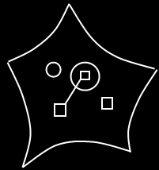
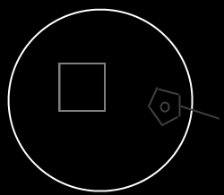
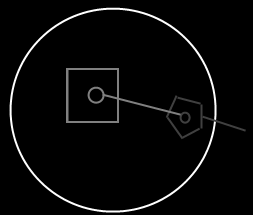
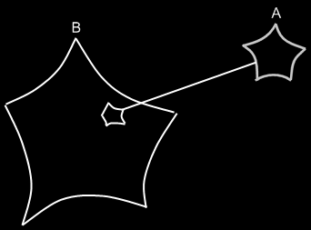

Circle Language Spec: Modules
=============================

Modules
-------

### **Concept**
A module is like a little world in which objects and commands live. A module can be a site, a computer program, a library or other kind of module. A module groups together functionality or data.

A module is an object with a special property. Anything directly inside the module can be directly referenced from anywhere within the module. That is the basic principle. However, you don’t have to make everything directly inside the module accessible globally; you have to actively declare them as being globally accessible. If members of a module are just publically accessible, they are not globally accessible, they are just accessible as members of an object, and not accessible from anywhere within the module. It’s also not entirely true, that everything inside the module can access the global members. You can only access global member from members, whose fixed logical residence is inside the module. So global things can only be directly accessed from definitions, whose fixed logical residence is inside the module. Things *referenced* inside the module, whose definition is elsewhere, can not access the global members.

You can reference a module like referencing an object. In that case it behaves like a normal object reference.

You can also reference a module directly from within another module. In that case, one module has a reference to another: one module has a reference to another module. Everything of the referenced module is now globally accessible from anywhere within the other module.

You don’t need to let modules refer to eachother, to actually let one module use something from another module: one module can always access anything inside another module, whether it has a reference to it or not. A reference however, makes global things from one module, globally accessible inside another module.
### **In a Diagram**
The principle of module is explained in the article *Module*. This article demonstrates its expression in a diagram.

A module is displayed as a pentagon shape

Objects and commands can be placed inside the pentagon.

Access to global members happens in the diagram in the following way.

Definitions anywhere within the module can access anything declared global. To make reference lines to global members more overviewable, imaginary intermediate references to the module are added to all the mutual parents from which global things are accessed. See the article *Automatic Containment* for information about imaginary references and mutual parents.

The module itself might not be in sight, when you are zoomed in on *part* of the module. The solution is, that an imaginary reference to the module is always displayed at the highest visible level of containment.

The imaginary reference to the module displays all the global members of the module. You can point to the global things you see inside this imaginary reference.

The imaginary references to module are displayed as pentagons, that’s how you recognize it is global things you are accessing.

Here is a module with a reference to another module:

This makes all the global members of module A, globally accessible from inside module B.
## **Ideas**
*The texts below are ideas yet to be turned into good documentation.*
### **Out of the original Symbol documentation**
#### *Multiple Module Levels*
A module B inside a module A is accessible by A. A module C inside module B is not accessible by A unless declared public.

module A outside module B can not be accessed by B.

What about ‘system wide’ things that can be accessed from anywhere? It can be reached from embedded modules, which disobeys the rule just defined. If it’s really system wide, then you simply embed a module by linking to the shared instance of a module.

But what if it’s less system wide? In that case it seems that a deep module has access to a shallower module… << I’ll figure out later >>

If a module is declared public, it becomes a sub module in the Sigma module.

Global is a bad term.

Because global insinuates its scope is the entire earth.

That’s why I call it a *module*. That implies there can be multiple modules. But still it might be a bad term, because it’s not really global (the entire earth). But then again: a module was defined as ‘a little world in which objects live’. So then it is a good term again.

2004,

A pentagon's direct children can all reference eachother and can be

referenced by all ancestors (containmentwise ancestors). Module is

only one function of a pentagon. Actually a pentagon is a lot like

module, where there are multiple levels of module and that exists in today's systems.

JJ

#### *System Procedures for Modules*
System procedures of modules are the same as for other object symbols. The only restriction is that modules can’t have lines to objects and objects can’t have lines to modules. Modules can have an object line, type line and interface line just like objects.

