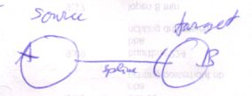
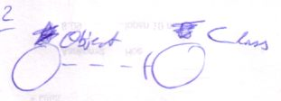

Circle Language Spec
====================

Redirection
------------

The text below comes out of the old Symbol documentation. I could not place it in any of the documentation sections, because it speaks about redirection mixing object, class and interface redirection, and I only gradually introduce those in different documentation sections, so I could not place a joint explanation or redirection in any of the documentation sections yet.

## Out of the old Symbol documentation

## Lines

### Target Symbols

#### Line Targets

Lines redirect a *system aspect* of a symbol to another symbol.

For instance: an object symbol can serve as its own object:

But if it has an object line, it is no more than a pointer to an object, rather than the object itself, while te target of the line is regarded the real object. 

*A is a pointer, B is the object.*

The object symbol *redirects* its *object* system aspect to another symbol. Lines *are* redirection.

#### Terms

There’s a lot to be said about the terminoligy around target symbols. I’ve put all this in this section. I kept these discussions out of the original text of ‘Target Symbols’, because it would obscure the main point.

##### Target Symbol

The target of a line, the *line target*, is also called a *target symbol*, while the line owner is can also be called the *source symbol* or, less commonly: the *line source*.

##### Source

Be careful with the term *source* in this context, though. You can speak of the source of a line:

**A** is considered the line’s source. **B** is the opposite party: the *target*. *Source* in this context expresses a party of a line. 

When you use the term *source* to denote a *relation between symbols*, it actually means *the same* as the term target. The terms are not opposites, they’re equivalents.

**Type** can be considered **Object**’s type target, because **Object**’s type line points to it. **Type** can also be considered **Object**’s type source, because **Type** serves as the type of **Object**.

##### ‘Target’

The term *target* is used for both intermediate targets and the final target symbols. To be more exact about what target you’re talking about you can use the terms *direct*, *intermediate* and *final*. The *direct object* of **A** in the picture <there is no picture…> above, for instance, is **B**, while the *final object* is **C**. **B** is also regarded an *intermediate object target*, or *intermediate object*, because it’s not the final target, nor the line source. The unaugmented terms *target object*, *target type*, *target interface* and *target procedure* are by rule reserved for final targets. If you want to denote an intermediate object target, for instance use the term *object target*, instead of *target object*, or say *intermediate target object*,* but don’t use the unaugmented term *target object* for an intermediate symbol. Many times out of the context it can be understood whether there is talked about a direct, intermediate or a final target, so it’s not always extra denoted. The term target *symbol* can be about any redirection step or be about any the final target of any aspect.

*Object target* is not the same as *target object*. *Object target* denotes the direct target of an object line. *Target object* denotes the symbol that is regarded to *really* represent the object.

The terms *object*, *type* and *interface* can denote the line target of an object line, type line or interface line. The terms *object*, *type* and *interface* are used for *final* targets as well as *direct* targets. The context may illustrate what I’m talking about or I’ll use a more specific term.

##### Redirection and Trace

Each *step* in a trace is called a *redirection*, because following a line is called a redirection. The whole tracing process can also be referred to as *the redirection*, even though it’s also called a *trace*.

##### Interface Definition

The final target interface is also called the *interface definition*.

##### Object Definition

The type of an object symbol is sometimes called the definition of the object, because the type of the object determines the object’s systematics for a great part. Just like the definition of a call determines the systematics of a procedure. The term *definition of object* could also mean the target object, though, so it’s easy to say something ambiguous.

##### Object Delegation

Delegating the object aspect is the main type of object redirection. Because it is the main one, it can also be called *the* delegation or *object delegation*.

##### Procedure Definition Trace

The procedure definition trace can also be called the *procedure trace* or the *definition trace*.

